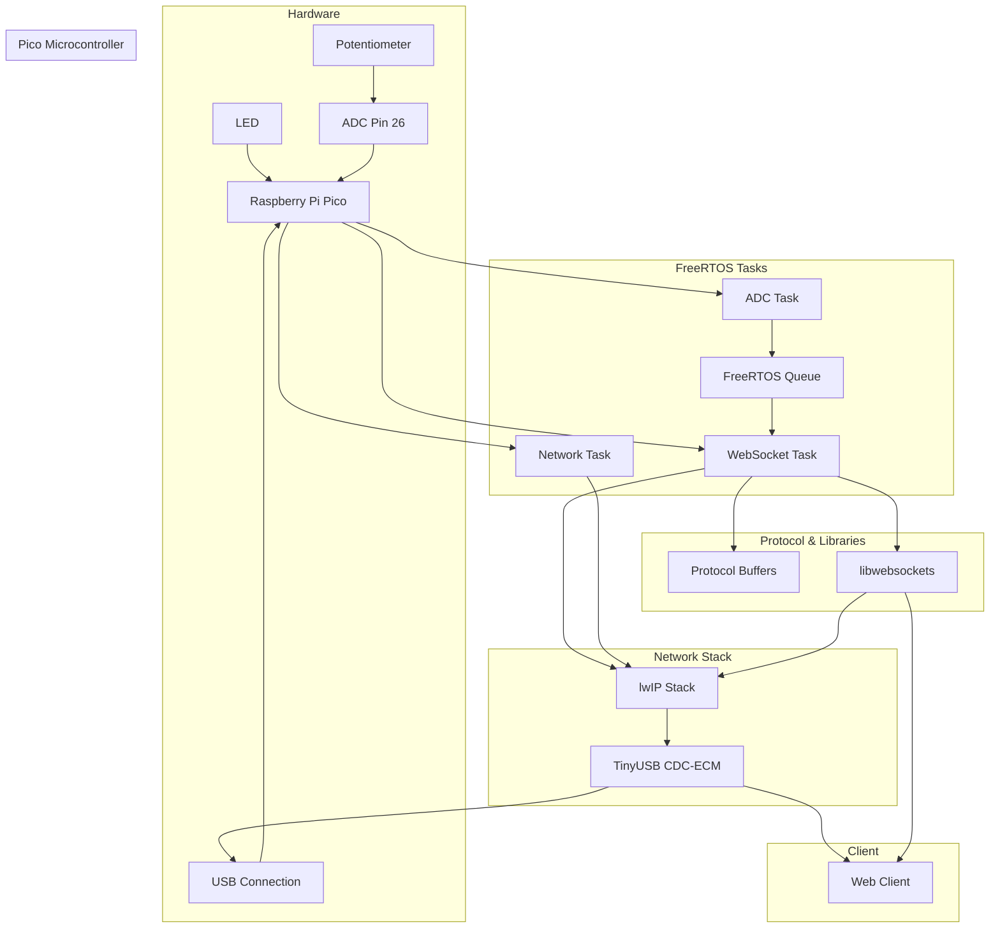

# Pico WebSocket Server

This project implements a WebSocket server on a Raspberry Pi Pico microcontroller that streams potentiometer readings over WebSocket using Protocol Buffers for data serialization.

## Architecture

## Overview

The system uses FreeRTOS to manage multiple concurrent tasks:
- ADC task: Reads values from a potentiometer connected to GPIO pin 26
- Network task: Handles lwIP networking stack processing
- WebSocket task: Manages WebSocket connections and data transmission

Data is transmitted using Protocol Buffers (nanopb) in a simple message format that includes:
- Potentiometer reading (uint32)
- Generator ID (uint32)

The device connects to a host computer via USB using TinyUSB's CDC-ECM (Ethernet) functionality, creating a virtual network interface with a static IP address (192.168.7.1).

## Dependencies

- FreeRTOS: Real-time operating system
- Pico SDK: Raspberry Pi Pico SDK
- nanopb: Protocol Buffers for embedded systems
- libwebsockets: WebSocket implementation
- lwIP: Lightweight IP stack
- TinyUSB: USB stack

## Setup Guide

Assumes all code libraries can be found at
/Users/ikellymo/code/libraries/
and this folder contains (And configured in .bash_profile)
- nanopb-0.4.7-macosx-x86 (NANOPB_PATH)
- pico-sdk (PICO_SDK_PATH)

Protobuf message contained in ProjectFiles/nanopb/message.proto

Install nanopb, then cd into this project directory (where this readme file is) and run

`% /Users/ikellymo/pico/nanopb-0.4.7-macosx-x86/generator/nanopb_generator.py ProjectFiles/nanopb/message.proto`
`% Writing to ProjectFiles/nanopb/message.pb.h and ProjectFiles/nanopb/message.pb.c`

## Hardware Connections

- Connect a potentiometer to GPIO pin 26 (ADC0)
- USB connection to host computer for power, programming, and network communication

## Network Configuration

- Static IP: 192.168.7.1
- Netmask: 255.255.255.0
- Gateway: 192.168.7.1
- WebSocket server port: 9000

## Building and Flashing

The project uses CMake for building. The main executable is named `out`.

## Todo
- Get "Build", "Debug" and "Launch" buttons working in VSCode
- Move JS project over into this repo so that comm's can be managed together
- Add freeRTOS-Plus-IO to the project
- Rename project
- Clean-up CMakeLists.txt files
- Get rid of PATH variable dependencies in CMakeLists.txt files
